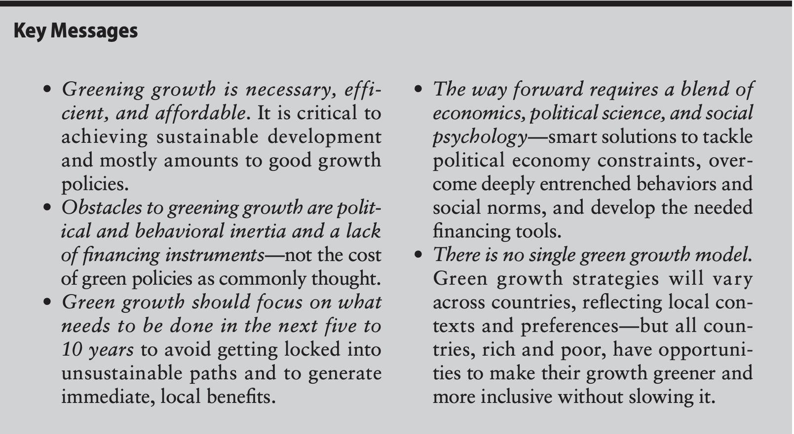

```{r, echo=FALSE, message=FALSE, warning=FALSE}

library(ggplot2)
library(ggthemr)
library(scales)
library(hexView)
library(patchwork)

knitr::opts_chunk$set(fig.width=15, fig.height=5, fig.align = 'center')

vars <- readEViews('annual_data2.wf1')
vars$period <- seq(1949, 2018, 1)


ggthemr('greyscale')


```


class: middle, center, inverse


.b[Marcio Santetti]


.b[Ph.D. Candidate]

.b[University of Utah]


[`r fontawesome::fa("envelope")` santetti@gmail.com](mailto:santetti@gmail.com) <br>
[`r fontawesome::fa("link")` marcio.rbind.io](https://marcio.rbind.io) <br>
[`r fontawesome::fa("github")` github.com/marciosantetti](https://github.com/marciosantetti)


---

# Replicate, replicate, replicate...


<br><br><br>

.hi[For *all* code and slide/style templates]:

<br>

[`r fontawesome::fa("github")` `github.com/marciosantetti/lawrence-university-talk`](https://github.com/marciosantetti/lawrence-university-talk)


---

# Reference


[Santetti, M. "What are the structural determinants of US carbon dioxide emissions? An econometric approach," 2021, ***International Journal of Applied Economics***, 18(2): 44–80.](https://conferencenow.info/yhsing/applied-economics-journals/IJAE/2021/IJAE%20SEPT%202021%20Santetti%2012-12-2021%20V1.pdf)

--


Final chapter of Ph.D. Dissertation

  - "*Three essays on growth, distribution, and the environment*"
  
--
  
First chapter:

  - "[*Growth, cycles, and residential investment* (Job Market Paper)](https://marcio.rbind.io/jmp/Santetti_GCRI.pdf).
  
Second chapter:

  - ["*The US labor share of income: What shocks matter?*"](https://www.tandfonline.com/doi/full/10.1080/00346764.2020.1821907)
  
    - with Ivan Mendieta-Muñoz, Codrina Rada, and Rudiger von Arnim, 2020, *** Review of Social Economy***, DOI: 10.1080/00346764.2020.1821907.


---


# Outline

<br>


1. Introduction

2. Literature review

3. Empirical strategy

4. Data

5. Results

6. Conclusions


---

layout: false
class: inverse, middle

# Introduction


---

# Introduction

<br><br>

.pull-left[
.hi[Research Questions]:

1. What are the most relevant **structural determinants** of carbon dioxide emissions in the US economy over the post-war period?

2. What is the role of **technological progress** in this setting? Does it lead to emissions mitigation?
]

--

.pull-right[
.hi[Methodology]:

1. Theoretically identified Vector Autoregressive (VAR) models, inspired by an extended Kaya identity and the green growth hypothesis;

2. Two different methodologies: one- and two-step VAR procedures
]

---

# Introduction


<br><br>

.hi[Contributions]:

1. Empirical methodology based on **theoretical assumptions**;

2. Historically, the US economy's technological progress path **does not** support reductions in emissions.

  - Inconsistent with green growth/absolute decoupling scenario.
  
--

In addition, novel econometric methodology

  - [`Kilian (2009)`](https://www.aeaweb.org/articles?id=10.1257/aer.99.3.1053);
  - [`Mendieta-Munoz et al. (2020)`](https://www.tandfonline.com/doi/full/10.1080/00346764.2020.1821907).
 

---

layout: false
class: inverse, middle

# Literature review

---

# Literature review


.pull-left[

.hi["Backward-looking"]:


* Using historical data to
investigate short- and long-run **dynamic linkages** between environmental and
macroeconomic variables.

  * [`Copeland and Taylor (2004)`](https://www.aeaweb.org/articles?id=10.1257/002205104773558047);
  * [`Soytas et al. (2007)`](https://www.sciencedirect.com/science/article/pii/S0921800906003430);  
  * [`Hossain (2011)`](https://www.sciencedirect.com/science/article/pii/S030142151100574X);
  * [`O'Mahony (2013)`](https://www.sciencedirect.com/science/article/pii/S0301421513002504); 
  * [`Shahiduzzaman and Layton (2015)`](https://www.sciencedirect.com/science/article/pii/S0306261915004468). 
]


--


.pull-right[

.hi[Policy-oriented]:

* Only a **big push** with
(coordinated) public investments towards renewable energy sources and increased carbon
taxes can trigger a shift to mitigate climate change.

  * [`Nordhaus (2008, 2014)`](https://www.journals.uchicago.edu/doi/full/10.1086/676035); 
  * [`Heutel (2012)`](https://www.sciencedirect.com/science/article/pii/S1094202511000238);
  * [`Rezai et al. (2018)`](https://www.sciencedirect.com/science/article/pii/S0921800917312041);
  * [`Mattauch et al. (2019)`](https://www.aeaweb.org/articles?id=10.1257/aer.20190089);
  * [`Semieniuk et al. (2021)`](https://www.nature.com/articles/s41558-020-00975-7).
]

---

# Literature review

<br>


.hi[The green growth hypothesis]:

* **Technological progress** and **resource substitution** are the drivers of a concomitant scenario of economic growth and emissions mitigation (**absolute** decoupling).

  * [`OECD (2011)`](https://www.oecd.org/greengrowth/48012345.pdf);
  * [`UNEP (2011)`](https://www.unep.org/resources/report/towards-green-economy-pathways-sustainable-development-and-poverty-eradication-10);
  * [`World Bank (2012)`](https://openknowledge.worldbank.org/handle/10986/6058);
  * [`Jacobs (2013)`](https://www.google.com/books/edition/The_Handbook_of_Global_Climate_and_Envir/JYuwDQAAQBAJ?hl=en&gbpv=1&dq=falkner+green+growth+handbook&pg=PR8&printsec=frontcover);
  * [`Hickel and Kallis (2020)`](https://www.tandfonline.com/doi/abs/10.1080/13563467.2019.1598964).
  
---

# Literature review

[`OECD (2011)`](https://www.oecd.org/greengrowth/48012345.pdf):

.center[


]

---

# Literature review

[`World Bank (2012)`](https://openknowledge.worldbank.org/handle/10986/6058):

.center[

]

---

# Literature review

<br><br>

.pull-left[
.hi[Relative decoupling]

* When the growth rate of the environmentally relevant variable is less than GDP growth for a given period (OECD, 2002).

  - $\dfrac{\text{Emissions/Energy use}}{\text{Output}} < 0$

]

--

.pull-right[
.hi[Absolute decoupling]

* Despite GDP growth, when the growth rate of the environmentally damaging variable is zero or negative (OECD, 2002).
]


---

layout: false
class: inverse, middle

# Empirical strategy

---

# Empirical strategy


.pull-left[

Carbon emissions, $\Phi_t$, are a product of the interactions of:

* the **state of the business cycle**, $Y_t$;

* **aggregate primary energy demand** 

  * including both renewable and non-renewable sources, $E_t$;

* **population growth**, $P_t$;

* and the **number of employed workers**, $L_t$.
]

--

.pull-right[

 An extended .hi[Kaya identity]:

$$ \Phi_t \equiv \dfrac{Y_t}{L_t} \cdot \dfrac{E_t}{Y_t} \cdot \dfrac{\Phi_t}{E_t} \cdot \dfrac{L_t}{P_t} \cdot P_t  $$

where

* $Y_t/L_t$: labor productivity;

* $E_t/Y_t$: energy intensity of output;

* $\Phi_t/E_t$: emissions intensity of energy use;

* $L_t/P_t$: employment rate.]


---

# Empirical strategy


Technology plays a *key role* for both **relative** and **absolute** decoupling scenarios.

--

<br>

.pull-left[

Decomposing energy intensity:

$$\dfrac{E_t}{Y_t} \equiv \dfrac{L_t}{Y_t} \cdot \dfrac{E_t}{L_t}$$
where
* $E_t/L_t$: energy-labor ratio

]


--

.pull-right[

In growth rates:

$$\hat{\eta} \equiv \hat{\epsilon} - \hat{\xi}$$
whenever labor productivity growth $(\hat{\xi})$ is *faster* than the growth of the energy-labor ratio $(\hat{\epsilon})$, there is a **relative** decoupling between energy use and output $(\hat{\eta}<0)$.

]

---

# Empirical strategy

<br><br>

.pull-left[

Decomposing emissions intensity of energy use:
$$\dfrac{\Phi_t}{E_t} \equiv \dfrac{\Phi_t}{L_t} \cdot \dfrac{L_t}{E_t}$$
where
* $\Phi_t/L_t$: emissions per worker

]

--

.pull-right[

In growth rates:

$$\hat{\Phi} \equiv \hat{\mu} + \hat{Y} - \hat{\xi}$$
whenever labor productivity  grows *faster* than the sum of the growth rates of emissions per worker $(\hat{\mu})$ and output $(\hat{Y})$, there is an **absolute** decoupling $(\hat{\Phi}<0)$.

]


---


# Empirical strategy


<br>

* The green growth hypothesis claims that *technological progress* is the .hi[main driver] of a possible absolute decoupling;

<br>

--

* Along with the *extended* Kaya identity, this view inspires the .hi[identification] of VAR models;

<br>

--

* Technological progress $\implies$ more efficient use of traditional energy sources and/or use of renewable sources $\implies$ increasing employment in new industries $\implies$ higher output/decreased emissions.


---

# Empirical strategy


### VAR identification:

.center[
Short-run causal ordering: $X_t$  $\rightarrow$ $E_t$ $\rightarrow$ $P_t$ $\rightarrow$ $Y_t$ $\rightarrow$ $\Phi_t$ 

Endogenous regressors vector: $\nu_t = (X_t, E_t, R_t, P_t, Y_t, \Phi_t)'$

Accounting for non-renewable $(E_t)$ and renewable $(R_t)$ energy use.
]

--

.pull-left[
* A VAR(*p*) model:
$$A\nu_t = \alpha + \sum_{i=1}^{p} A_{i} \nu_{t-i} + u_{t}$$
* Reduced-form residuals
$$\varepsilon_t = A^{-1}u_t$$
]

.pull-right[
$$\small \varepsilon_{t} \equiv
\left[ \begin{array}{c}
\varepsilon_t^{X} \\
\varepsilon_t^{E} \\
\varepsilon_t^{R} \\
\varepsilon_t^{P} \\
\varepsilon_t^{Y} \\
\varepsilon_t^{\Phi} \end{array} \right]
=
\left[ \begin{array}{cccccc}
1 & 0 & 0 & 0 & 0 & 0 \\
a_{21} & 1 & 0 & 0 & 0 & 0 \\
a_{31} & a_{32} & 1 & 0 & 0 & 0 \\
a_{41} & a_{42} & a_{43} & 1 & 0 & 0 \\
a_{51} & a_{52} & a_{53} & a_{54} & 1 & 0 \\
a_{61} & a_{62} & a_{63} & a_{64} & a_{65} & 1 \end{array} \right]
\left[ \begin{array}{c}
u_t^{\text{X}} \\
u_t^{\text{E}} \\
u_t^{\text{R}} \\
u_t^{\text{P}} \\ 
u_t^{\text{Y}} \\ 
u_t^{\Phi} \end{array} \right]$$
]

---

# Empirical strategy

.hi[Two recursive VAR estimation methodologies]:

.pull-left[
* A **single-step** procedure:

  * Directly computing the response of emissions to **all** structural shocks, estimating a 6-variable VAR.
]

--

.pull-right[
* A **two-step** procedure:
  
  * Estimating a first-step VAR **without** emissions, retrieving its residuals (shocks);
  * In a *second step*, computing the response of emissions to these structural shocks.
  * Why **two steps**? To avoid potential *endogenous interactions* between emissions and the other variables, possibly affecting the impulse-response analysis.

]


---

layout: false
class: inverse, middle

# Data

---


# Data

* **Sample period**: 1949&#8212;2018


---


# Data

.hi[Variables]:
  
* Aggregate carbon dioxide emissions (US EIA) &#8212; million metric tons of carbon dioxide;
  
--
  
* Aggregate primary energy use (quadrillion Btu):
      
      * Non-renewable energy use (US EIA) - fossil fuels, nuclear energy;
      * Renewable energy use (US EIA) - hydroelectric, geothermal, wind, solar, and biomass.
      
--
  
* Employment-to-population ratio (FRED) &#8212; %;

--
  
* Real GDP (FRED) &#8212; billions of chained 2012 dollars;

--
  
* Technology variables: 
  
      * labor productivity (output per hour, business sector, FRED) &#8212; baseline; 
      * aggregate capital stock (1950&#8212;2017, PWT) &#8212; millions of 2011 US dollars;
      * total factor productivity (1954&#8212;2017, PWT) &#8212; 2011=1.
      
    
---

# Data

<br>

```{r, echo=FALSE, warning=FALSE, message=FALSE, fig.retina=4}
ts3 <- ggplot(vars, aes(y=LN_B, x=period)) + geom_line(size=1)  + 
  scale_x_continuous(breaks=c(1949, 1960, 1970, 1980, 1990, 2000, 2010, 2018)) +
  labs(title='Carbon dioxide emissions', x="", y="") + theme(axis.text= element_text(size = 13)) 

ts4 <- ggplot(vars, aes(y=LN_E, x=period)) + geom_line(size=1)  + 
  scale_x_continuous(breaks=c(1949, 1960, 1970, 1980, 1990, 2000, 2010, 2018)) +
  labs(title='Non-renewable energy use', x="", y="") + theme(axis.text= element_text(size = 13)) 

ts5 <- ggplot(vars, aes(y=LN_R, x=period)) + geom_line(size=1)  + 
  scale_x_continuous(breaks=c(1949, 1960, 1970, 1980, 1990, 2000, 2010, 2018)) +
  labs(title='Renewable energy use', x="", y="") + theme(axis.text= element_text(size = 13)) 


ts3 | ts4 | ts5


```


---

# Data

```{r, echo=FALSE, warning=FALSE, message=FALSE, fig.retina=4, fig.asp=0.5}
ts9 <- ggplot(vars, aes(y=EY*100, x=period)) + geom_line(size=1)  + 
  scale_x_continuous(breaks=c(1949, 1960, 1970, 1980, 1990, 2000, 2010, 2018)) +
  labs(title='Energy intensity', x="", y='', subtitle=expression(10^-2)) + 
  theme(axis.text= element_text(size = 13)) 

ts10 <- ggplot(vars, aes(y=EL*1000, x=period)) + geom_line(size=1)  + 
  scale_x_continuous(breaks=c(1949, 1960, 1970, 1980, 1990, 2000, 2010, 2018)) +
  scale_y_continuous(breaks=pretty_breaks(n=5)) +
  labs(title='Energy-labor ratio', x="", y="", subtitle=expression(10^-3)) + 
  theme(axis.text= element_text(size = 13)) 

ts11 <- ggplot(vars, aes(y=BE, x=period)) + geom_line(size=1)  + 
  scale_x_continuous(breaks=c(1949, 1960, 1970, 1980, 1990, 2000, 2010, 2018)) +
  labs(title='Emissions intensity of energy use', x="", y="") + theme(axis.text= element_text(size = 13)) 

ts12 <- ggplot(vars, aes(y=BL*100, x=period)) + geom_line(size=1)  + 
  scale_x_continuous(breaks=c(1949, 1960, 1970, 1980, 1990, 2000, 2010, 2018)) +
  labs(title='Emissions per worker', x="", y="", subtitle=expression(10^-2)) + 
  theme(axis.text= element_text(size = 13)) 


(ts9 | ts11) / (ts10 | ts12)

```


---
 
# Results

.pull-left[

.hi[Baseline VAR models]:

* Single-step VAR: estimated *in levels* 

  * 3 lags
  * no serial correlation nor heteroskedasticity;

* Two-step VAR: estimated *in levels*

  * 4 lags
  * no serial correlation nor heteroskedasticity;

* Labor productivity as the technology variable.

]

--

.pull-right[

.hi[Robustness checks]:

* Single and two-step VAR models

  * in *first-differences* and 
  * with data *de-trended* with the HP filter;

* Models with two different technology *proxy* variables: 

  * aggregate capital stock and 
  * total factor productivity (TFP).

]

---

layout: false
class: inverse, middle

# Results

---

# Results

* Single-step VAR (only carbon dioxide responses):

```{r, echo=FALSE, warning=FALSE, message=FALSE, fig.retina=4, fig.asp=0.4}

one <- read.csv2('fvar_levels_row1.csv', header=TRUE, sep=',', dec='.')
two <- read.csv2('fvar_levels_row2.csv', header=TRUE, sep=',', dec='.')
three <- read.csv2('fvar_levels_row3.csv', header=TRUE, sep=',', dec='.')
four <- read.csv2('fvar_levels_row4.csv', header=TRUE, sep=',', dec='.')
five <- read.csv2('fvar_levels_row5.csv', header=TRUE, sep=',', dec='.')
six <- read.csv2('fvar_levels_row6.csv', header=TRUE, sep=',', dec='.')

f61 <- ggplot(six, aes(x=period, y=ln_x)) + 
  geom_line(lwd=1, col='grey45') + 
  geom_line(aes(y=se1), linetype='dashed', col='grey45')  + 
  geom_line(aes(y=se2), linetype='dashed', col='grey45') +
  geom_hline(yintercept = 0, size=1.5) + scale_x_continuous(breaks=pretty_breaks()) +
  labs(x="", y="") + ggtitle(expression(X[t] %->% Phi[t])) + theme(axis.text= element_text(size = 13))

f62 <- ggplot(six, aes(x=period, y=ln_e)) + 
  geom_line(lwd=1, col='grey45') + 
  geom_line(aes(y=se3), linetype='dashed', col='grey45')  + 
  geom_line(aes(y=se4), linetype='dashed', col='grey45') +
  geom_hline(yintercept = 0, size=1.5) + scale_x_continuous(breaks=pretty_breaks()) +
  labs(x="", y="") + ggtitle(expression(E[t] %->% Phi[t])) + theme(axis.text= element_text(size = 13))

f63 <- ggplot(six, aes(x=period, y=ln_r)) + 
  geom_line(lwd=1, col='grey45') + 
  geom_line(aes(y=se5), linetype='dashed', col='grey45')  + 
  geom_line(aes(y=se6), linetype='dashed', col='grey45') +
  geom_hline(yintercept = 0, size=1.5) + scale_x_continuous(breaks=pretty_breaks()) +
  labs(x="", y="") + ggtitle(expression(R[t] %->% Phi[t])) + theme(axis.text= element_text(size = 13))

f64 <- ggplot(six, aes(x=period, y=ln_n)) + 
  geom_line(lwd=1, col='grey45') + 
  geom_line(aes(y=se7), linetype='dashed', col='grey45')  + 
  geom_line(aes(y=se8), linetype='dashed', col='grey45') +
  geom_hline(yintercept = 0, size=1.5) + scale_x_continuous(breaks=pretty_breaks()) +
  labs(x="", y="") + ggtitle(expression(P[t] %->% Phi[t])) + theme(axis.text= element_text(size = 13))

f65 <- ggplot(six, aes(x=period, y=ln_y)) + 
  geom_line(lwd=1, col='grey45') + 
  geom_line(aes(y=se9), linetype='dashed', col='grey45')  + 
  geom_line(aes(y=se10), linetype='dashed', col='grey45') +
  geom_hline(yintercept = 0, size=1.5) + scale_x_continuous(breaks=pretty_breaks()) +
  labs(x="", y="") + ggtitle(expression(Y[t] %->% Phi[t])) + theme(axis.text= element_text(size = 13))

f66 <- ggplot(six, aes(x=period, y=ln_b)) + 
  geom_line(lwd=1, col='grey45') + 
  geom_line(aes(y=se11), linetype='dashed', col='grey45')  + 
  geom_line(aes(y=se12), linetype='dashed', col='grey45') +
  geom_hline(yintercept = 0, size=1.5) + scale_x_continuous(breaks=pretty_breaks()) +
  labs(x="", y="") + ggtitle(expression(Phi[t] %->% Phi[t])) + theme(axis.text= element_text(size = 13))

(f61 | f62 | f63) / (f64 | f65 | f66)

```


---

# Results

* Two-step VAR (only carbon dioxide responses):


```{r, echo=FALSE, warning=FALSE, message=FALSE, fig.retina=4, fig.asp=0.4}

s1 <- read.csv2('s1.csv', header=T, dec='.', sep=',')
s2 <- read.csv2('s2.csv', header=T, dec='.', sep=',')
s3 <- read.csv2('s3.csv', header=T, dec='.', sep=',')
s4 <- read.csv2('s4.csv', header=T, dec='.', sep=',')
s5 <- read.csv2('s5.csv', header=T, dec='.', sep=',')


f7.1 <- ggplot(s1, aes(x=period, y=ln_b)) + geom_line(lwd=1, col='grey45') +
  geom_line(aes(y=se1), linetype='dashed', col='grey45')  + 
  geom_line(aes(y=se2), linetype='dashed', col='grey45') +
  geom_hline(yintercept = 0) + scale_x_continuous(breaks=c(1,2,3,4,5,6,7,8,9,10)) +
  labs(x="", y="") + ggtitle('Technology shock') +
  theme(axis.text= element_text(size = 13))

f7.2 <- ggplot(s2, aes(x=period, y=ln_b)) + geom_line(lwd=1, col='grey45') +
  geom_line(aes(y=se1), linetype='dashed', col='grey45')  + 
  geom_line(aes(y=se2), linetype='dashed', col='grey45') +
  geom_hline(yintercept = 0) + scale_x_continuous(breaks=c(1,2,3,4,5,6,7,8,9,10)) +
  labs(x="", y="") + ggtitle('Non-renewable energy use shock') +
  theme(axis.text= element_text(size = 13))

f7.3 <- ggplot(s3, aes(x=period, y=ln_b)) + geom_line(lwd=1, col='grey45') +
  geom_line(aes(y=se1), linetype='dashed', col='grey45')  + 
  geom_line(aes(y=se2), linetype='dashed', col='grey45') +
  geom_hline(yintercept = 0) + scale_x_continuous(breaks=c(1,2,3,4,5,6,7,8,9,10)) +
  labs(x="", y="") + ggtitle('Renewable energy use shock') +
  theme(axis.text= element_text(size = 13))

f7.4 <- ggplot(s4, aes(x=period, y=ln_b)) + geom_line(lwd=1, col='grey45') +
  geom_line(aes(y=se1), linetype='dashed', col='grey45')  + 
  geom_line(aes(y=se2), linetype='dashed', col='grey45') +
  geom_hline(yintercept = 0) + scale_x_continuous(breaks=c(1,2,3,4,5,6,7,8,9,10)) +
  labs(x="", y="") + ggtitle('Population shock') +
  theme(axis.text= element_text(size = 13))

f7.5 <- ggplot(s5, aes(x=period, y=ln_b)) + geom_line(lwd=1, col='grey45') +
  geom_line(aes(y=se1), linetype='dashed', col='grey45')  + 
  geom_line(aes(y=se2), linetype='dashed', col='grey45') +
  geom_hline(yintercept = 0) + scale_x_continuous(breaks=c(1,2,3,4,5,6,7,8,9,10)) +
  labs(x="", y="") + ggtitle('Output shock') +
  theme(axis.text= element_text(size = 13))
  

(f7.1 | f7.2 | f7.3) / (f7.4 | f7.5)

```


---


# Results

* Robustness checks for two-step VAR (non-renewable energy shock - black; technology shock - gray):


```{r, echo=FALSE, warning=FALSE, message=FALSE, fig.retina=4, fig.asp=0.4}

robdiff1 <- read.csv2('s6-7.csv', header=T, dec='.', sep=',')
robdiff2 <- read.csv2('s11-12.csv', header=T, dec='.', sep=',')
robdiff3 <- read.csv2('s13-14.csv', header=T, dec='.', sep=',')


hp1 <- read.csv2('s15-16.csv', header=T, dec='.', sep=',')
hp2 <- read.csv2('s17-18.csv', header=T, dec='.', sep=',')
hp3 <- read.csv2('s19-20.csv', header=T, dec='.', sep=',')


fd_x <- ggplot(robdiff1, aes(x=period, y=ln_b)) + geom_line(col='grey37', alpha=0.7, lwd=1) +
  geom_line(aes(y=se1), linetype='dashed', col='grey37') +
  geom_line(aes(y=se2), linetype='dashed', col='grey37') +
  geom_line(aes(y=se1e), linetype='dotdash', col='grey3', lwd=1) +
  geom_line(aes(y=se2e), linetype='dotdash', col='grey3', lwd=1) +
  geom_hline(yintercept=0) +
  geom_line(aes(y=ln_be), col='grey3', alpha=0.7, lwd=1) +
  scale_x_continuous(breaks=c(2,4,6,8,10)) +
  labs(x="", y="", subtitle='First differences') + ggtitle('Labor productivity') +
  theme(axis.text= element_text(size = 13))

fd_k <- ggplot(robdiff2, aes(x=period, y=ln_b)) + geom_line(col='grey37', alpha=0.7, lwd=1) +
  geom_line(aes(y=se1), linetype='dashed', col='grey37') +
  geom_line(aes(y=se2), linetype='dashed', col='grey37') +
  geom_line(aes(y=se1e), linetype='dotdash', col='grey3', lwd=1) +
  geom_line(aes(y=se2e), linetype='dotdash', col='grey3', lwd=1) +
  geom_hline(yintercept=0) +
  geom_line(aes(y=ln_be), col='grey3', alpha=0.7, lwd=1) +
  scale_x_continuous(breaks=c(2,4,6,8,10)) +
  labs(x="", y="", subtitle='First differences') + ggtitle('Capital stock') +
  theme(axis.text= element_text(size = 13))

fd_tfp <- ggplot(robdiff3, aes(x=period, y=ln_b)) + geom_line(col='grey37', alpha=0.7, lwd=1) +
  geom_line(aes(y=se1), linetype='dashed', col='grey37') +
  geom_line(aes(y=se2), linetype='dashed', col='grey37') +
  geom_line(aes(y=se1e), linetype='dotdash', col='grey3', lwd=1) +
  geom_line(aes(y=se2e), linetype='dotdash', col='grey3', lwd=1) +
  geom_hline(yintercept=0) +
  geom_line(aes(y=ln_be), col='grey3', alpha=0.7, lwd=1) +
  scale_x_continuous(breaks=c(2,4,6,8,10)) +
  labs(x="", y="", subtitle='First differences') + ggtitle('Total factor productivity') +
  theme(axis.text= element_text(size = 13))


hp_x <- ggplot(hp1, aes(x=period, y=ln_b)) + geom_line(col='grey37', alpha=0.7, lwd=1) +
  geom_line(aes(y=se1), linetype='dashed', col='grey37') +
  geom_line(aes(y=se2), linetype='dashed', col='grey37') +
  geom_line(aes(y=se1e), linetype='dotdash', col='grey3', lwd=1) +
  geom_line(aes(y=se2e), linetype='dotdash', col='grey3', lwd=1) +
  geom_hline(yintercept=0) +
  geom_line(aes(y=ln_be), col='grey3', alpha=0.7, lwd=1) +
  scale_x_continuous(breaks=c(2,4,6,8,10)) +
  labs(x="", y="", subtitle='HP filter') + ggtitle('Labor productivity') +
  theme(axis.text= element_text(size = 13))

hp_k <- ggplot(hp2, aes(x=period, y=ln_b)) + geom_line(col='grey37', alpha=0.7, lwd=1) +
  geom_line(aes(y=se1), linetype='dashed', col='grey37') +
  geom_line(aes(y=se2), linetype='dashed', col='grey37') +
  geom_line(aes(y=se1e), linetype='dotdash', col='grey3', lwd=1) +
  geom_line(aes(y=se2e), linetype='dotdash', col='grey3', lwd=1) +
  geom_hline(yintercept=0) +
  geom_line(aes(y=ln_be), col='grey3', alpha=0.7, lwd=1) +
  scale_x_continuous(breaks=c(2,4,6,8,10)) +
  labs(x="", y="", subtitle='HP filter') + ggtitle('Capital stock') +
  theme(axis.text= element_text(size = 13))

hp_tfp <- ggplot(hp3, aes(x=period, y=ln_b)) + geom_line(col='grey37', alpha=0.7, lwd=1) +
  geom_line(aes(y=se1), linetype='dashed', col='grey37') +
  geom_line(aes(y=se2), linetype='dashed', col='grey37') +
  geom_line(aes(y=se1e), linetype='dotdash', col='grey3', lwd=1) +
  geom_line(aes(y=se2e), linetype='dotdash', col='grey3', lwd=1) +
  geom_hline(yintercept=0) +
  geom_line(aes(y=ln_be), col='grey3', alpha=0.7, lwd=1) +
  scale_x_continuous(breaks=c(2,4,6,8,10)) +
  labs(x="", y="", subtitle='HP filter') + ggtitle('Total factor productivity') +
  theme(axis.text= element_text(size = 13))


(fd_x | fd_k | fd_tfp) / (hp_x | hp_k | hp_tfp)

```


---

layout: false
class: inverse, middle

# Conclusions

---

# Conclusions


* Most of the estimated models compute both **non-renewable** and **technology** shocks  significantly affecting carbon dioxide emissions over the short-run for the US economy;

--

* While the baseline single-step procedure only predicts a non-renewable energy shock as statistically significant, the two-step baseline model includes the **technology** shock as significant;

--

* Despite the historical positive growth rates of both labor and energy productivity, the US economy's  historical growth path has neither been translated into a **decreased** use of "dirty" energy sources, nor into a significant use of **renewable** energy sources;

--

* In addition to these results, key **decoupling** variables have shown weak
growth paths over the sample period. Energy intensity, output intensity of energy use, emissions per
worker, and the energy-labor ratio levels are **far** from those observed by
countries experiencing absolute decoupling, such as France, Italy, and the
United Kingdom.


---

layout: false
class: inverse, middle

# .b[Thank you!]


---
exclude: true
